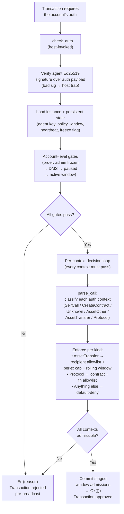

# Architecture

The `__check_auth` → `parse_call` → `decide` pipeline is the core of Stellar Agent Guard. Every transaction the guarded account makes flows through this pipeline.

## Pipeline diagram

## Walkthrough

### 1. Signature verification

`__check_auth` loads the registered agent pubkey and calls `env.crypto().ed25519_verify` over the transaction auth payload. This runs before any policy logic, so a compromised-but-unregistered key never reaches the decision table.

### 2. Policy snapshot

The current `PolicyConfig`, `AdminFrozen`, `LastHeartbeat`, and ledger time are loaded. No policy stored ⇒ `NoPolicy` — the account is default-deny.

### 3. Account-level gates

Evaluated in this order (first match wins):

| # | Condition | Result |
|---|---|---|
| 1 | `AdminFrozen` is set | Block (`AdminFrozen`) |
| 2 | DMS enabled AND `last_heartbeat != 0` AND `now - last_heartbeat > dms_grace_secs` | Block (`HeartbeatExpired`) |
| 3 | No `Policy` stored | Block (`NoPolicy`) |
| 4 | `paused` | Block (`Paused`) |
| 5 | Outside `active_from`/`active_until` | Block (`OutsideActiveWindow`) |

These gates apply **equally to every call** — SAC transfers, protocol calls, and even `heartbeat`.

### 4. Per-context classification

Each `Context` in `auth_contexts` is classified independently by `parse_call`:

| ParsedCall | Classification |
|---|---|
| `SelfCall { heartbeat }` | Allowed (only permitted self-call) |
| `SelfCall { other }` | Blocked (`SelfFunctionNotAllowed`) |
| `CreateContract` | Blocked (`CreateContractNotAllowed`) |
| `AssetTransfer` | Fully enforceable (recipient + amount parsed from args) |
| `AssetOther` (e.g., `mint`, `burn`) | Blocked (`FunctionNotAllowed`) |
| `Protocol` | Contract + function allowlist check |
| `Unknown` | Blocked (`UnknownContract`) — default-deny |

### 5. Per-kind enforcement

**Asset transfers** (SAC `transfer`/`transfer_from` on allowlisted assets):
1. Recipient allowlist check (unless `allow_any_recipient`)
2. Per-tx cap check
3. Rolling window projection (existing total + amounts staged earlier in this request)
4. Amount > 0 check

**Protocol calls** (allowlisted non-asset contracts):
1. Contract in `protocols` list
2. Function in rule's `fns` allowlist (if configured)

**Everything else:** Blocked.

### 6. All-or-nothing commit

Window admissions are **staged** — they are only committed to storage if *every* context passes. A partially-validating batch can never spend. `Ok(())` approves; `Err(reason)` rejects the entire transaction, and the `auth_checked` event records the outcome either way.

## Decision table

The full decision table from SPEC §4, evaluated against ledger time (which Soroban code cannot forge):

| Priority | Condition | Action | Error |
|---|---|---|---|
| 1 | `AdminFrozen` | Block | `AdminFrozen` |
| 2 | DMS grace elapsed | Block | `HeartbeatExpired` |
| 3 | No policy | Block | `NoPolicy` |
| 4 | `paused` | Block | `Paused` |
| 5 | Outside active window | Block | `OutsideActiveWindow` |
| 6 | Self-call to `heartbeat` | Allow | — |
| 7 | Per-context classification (§6) | Allow or Block | Various |

## Storage model

| Key | Type | Kind | Purpose |
|---|---|---|---|
| `Initialized` | `bool` | instance | One-time flag for `initialize` |
| `Admin` | `Address` | instance | Policy admin; set once at `initialize` |
| `AgentPubkey` | `BytesN<32>` | instance | Agent's Ed25519 public key |
| `Policy` | `PolicyConfig` | persistent | Current policy (`None` = default-deny) |
| `Window` | `WindowState` | persistent | Rolling spend ledger |
| `LastHeartbeat` | `u64` | persistent | Unix seconds of last heartbeat (0 = never) |
| `AdminFrozen` | `bool` | persistent | Admin-initiated freeze flag |

Instance keys auto-refresh TTL on every invocation; persistent keys are extended to the maximum TTL on every write.

## Code layout

| File | Purpose |
|---|---|
| `src/lib.rs` | Contract: lifecycle, admin, `__check_auth` (CustomAccount), events, storage helpers |
| `src/engine.rs` | Pure decision table over auth `Context`s — no storage access, fully unit-testable |
| `src/window.rs` | Genuinely rolling spend window (lazy prune, same-second coalescing, bounded backstop) |
| `src/types.rs` | Policy model, storage keys, errors, parsed-call enum |
| `src/integration_tests.rs` | Host-routed tests with real Ed25519 auth signatures |
